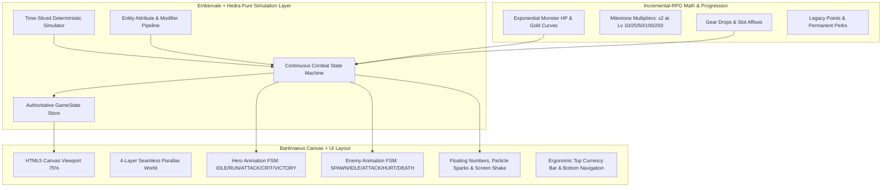

# Comparative Reverse-Engineering Audit of 4 Open-Source RPG / Idle / Incremental Projects

**Date:** 2026-08-20  
**Target Project:** `ubatora07/Game` (`feature/idle-rpg-reference-fusion`)  
**Auditor:** Senior Game Systems & Engine Architect  

---

## 1. Executive Summary & Synthesis Matrix

Four reference projects were cloned and audited at source code level:
1. **[WhiteMinds/trial-tower](https://github.com/WhiteMinds/trial-tower)** (MIT License): Modular TypeScript monorepo with `hedra-engine` simulation/presentation separation and attribute/modifier pipelines.
2. **[pablodcruz/embervale-idle](https://github.com/pablodcruz/embervale-idle)** (MIT License): Godot GDScript idle adventure engine with deterministic action-queue simulation (`simulation != presentation`) and time-slicing offline model.
3. **[MaxMusing/Incremental-RPG](https://github.com/MaxMusing/Incremental-RPG)** (MIT License): React incremental RPG with character attribute multipliers, exponential equipment stat generation, and skill-point allocation.
4. **[jacobziemba-dev/bartimaeus-idle-rpg](https://github.com/jacobziemba-dev/bartimaeus-idle-rpg)** (ISC License): TypeScript/Vite continuous horde battle loop with canvas rendering, floating damage text, and unified stage HUD.

| Core Area | Trial Tower (`hedra-engine`) | Embervale Idle | Incremental-RPG | Bartimaeus Idle RPG | Our Fusion Decision |
|---|---|---|---|---|---|
| **Combat Engine** | Turn/tick entity state machine (9/10) | Action queue timeline (7/10) | Auto-tick attack interval (6/10) | Continuous horde flow (8/10) | **ADAPT:** Entity state machine + continuous flow |
| **Simulation != Presentation** | Decoupled via `Stage` & `Store` (9/10) | Strict deterministic time-step (10/10) | Coupled to React state (4/10) | Canvas ticker separation (7/10) | **ADAPT:** Embervale/Hedra time-sliced simulation |
| **Progression Math** | Linear-to-exponential item levels (7/10) | Time-based gathering cycles (6/10) | Exponential cost & stat multipliers (8/10) | Stage scaling enemy pools (7/10) | **TAKE:** Incremental-RPG exponential milestones |
| **Battlefield UX / HUD** | Card widgets (5/10) | Minimal text logger (4/10) | Classic dashboard tables (4/10) | Living 2D canvas battle view (9/10) | **TAKE:** Bartimaeus 75% canvas viewport layout |
| **Loot & Equipment** | Template-driven with affix serialization (9/10) | Fixed resource drops (5/10) | Procedural weapon/armor types (8/10) | Inventory item sockets (7/10) | **ADAPT:** Template item generators with affix modifiers |

---

## 2. Project 1: WhiteMinds / trial-tower (Hedra Engine)

### Overview & License
- **License:** MIT License (`LICENSE` verified)
- **Tech Stack:** TypeScript, Lerna/Yarn Monorepo, React (Web), Node (Server)
- **Key Modules:** `packages/hedra-engine` (`MainStage`, `CombatStage`, `Entity`, `Item`, `Skill`, `Buff`, `Effect`)

### Detailed Evaluation
- **Architecture (9/10):** Clean separation between `Store`, `Stage`, and `Entity`. `MainStage` manages persistence and entity lifecycles; `CombatStage` runs transient combat simulations.
- **Combat (8/10):** Entity-centric with dynamic attribute pipelines (`baseStats`, `modifiers`, `buffs`).
- **Idle Loop (6/10):** Primarily dungeon/tower round-based rather than infinite traveling runner.
- **Progression (7/10):** Tower floor escalations with boss encounters and loot generator tables.
- **Economy & Balance (7/10):** Standard gold/EXP distribution from monster drops.
- **Equipment & Loot (9/10):** Robust template-driven item system with serialization and affix calculation.
- **Animation & Feedback (6/10):** Relies on DOM React cards rather than a unified 2D canvas scene.

### Take / Adapt / Ignore
- **TAKE:** Entity modifier/attribute pipeline concept for calculating aggregated hero damage, attack speed, and crit.
- **ADAPT:** `Stage` lifecycle and clean plugin hooks (`onKill`, `onCombatEnd`, `onBossSpawn`).
- **IGNORE:** Heavy React monorepo overhead and turn-based combat logger; our continuous real-time combat engine is better suited for idle clicker pacing.

---

## 3. Project 2: pablodcruz / embervale-idle

### Overview & License
- **License:** MIT License (`LICENSE` verified)
- **Tech Stack:** Godot 4.x, GDScript (`scripts/idle_simulator.gd`, `scripts/game_content.gd`)

### Detailed Evaluation
- **Architecture (9/10):** Outstanding architectural thesis: `simulation != presentation`. The simulation runs strictly as pure mathematical state mutations over `elapsed_seconds`, completely independent of FPS or visual tween durations.
- **Game Loop (8/10):** Deterministic action queue (`travel -> gather -> combat -> return`).
- **Offline Progression (9/10):** Time-slicing simulation with `EPSILON = 0.0001` allows instant calculation of 8 hours of offline progress without hanging the UI.
- **UI & Presentation (5/10):** Minimalist debug/prototype UI.

### Take / Adapt / Ignore
- **TAKE:** Strict `simulation != presentation` principle and pure mathematical time-slicing offline catch-up algorithm.
- **ADAPT:** Action state queue for smooth transitions (`RUNNING -> ENGAGING -> FIGHTING -> VICTORY -> RESUMING`).
- **IGNORE:** Godot-specific GDScript bindings and slow gathering cycles.

---

## 4. Project 3: MaxMusing / Incremental-RPG

### Overview & License
- **License:** MIT License (`LICENSE.md` verified)
- **Tech Stack:** React, JavaScript (`src/classes/Character.js`, `src/classes/Enemy.js`, `src/classes/Items.js`)

### Detailed Evaluation
- **Architecture (6/10):** OOP class hierarchy (`Character -> Hero / Enemy`, `Item -> Weapon / HeadArmour / ChestArmour / LegArmour`).
- **Incremental Math (8/10):** Clean exponential stat calculations with constitution HP multipliers (`1.1^level`), weapon attack speeds, and defense formulas.
- **Equipment & Loot (8/10):** Weighted random drop chances per enemy archetype with slot-based equipment swapping.
- **UI & HUD (4/10):** Traditional split dashboard tables with little visual focus on the world.

### Take / Adapt / Ignore
- **TAKE:** Multiplier milestone curves (`2x bonus at key level thresholds`) and exponential monster scaling.
- **ADAPT:** Procedural weapon/armor equipment slot stats.
- **IGNORE:** Direct DOM table layout; canvas 2D scene is superior for fantasy immersion.

---

## 5. Project 4: jacobziemba-dev / bartimaeus-idle-rpg

### Overview & License
- **License:** ISC License (`package.json`) — Cleanroom adaptation of architectural/UX patterns.
- **Tech Stack:** TypeScript, Vite, HTML5 Canvas (`src/scripts/battle.js`, `src/scripts/ui.js`, `src/styles/battle.css`)

### Detailed Evaluation
- **Architecture (7/10):** Modular JavaScript/TypeScript engine with dedicated `BattleManager`, `AssetManager`, `AdventureLog`.
- **Battle Scene & Canvas (9/10):** 70–80% viewport canvas where hero visually confronts continuous waves of enemies, with floating damage numbers, HP bars, and active attack feedback.
- **HUD & Ergonomics (9/10):** Clean top resource bar, center stage title with wave node counters, and bottom control row.
- **Feedback (8/10):** Floating damage text with alpha decay and screen impact flashes.

### Take / Adapt / Ignore
- **TAKE:** 75% Canvas battlefield layout and floating text physics.
- **ADAPT:** Wave progression node indicators and continuous monster encounter loop.
- **IGNORE:** Unlicensed direct assets; write our own cleanroom canvas rendering pipeline and custom pixel assets.

---

## 6. Architecture Fusion Blueprint for `ubatora07/Game`

